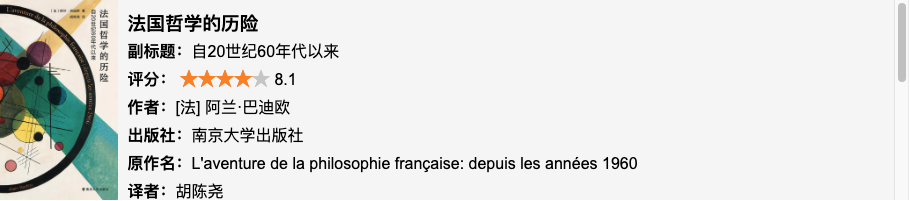
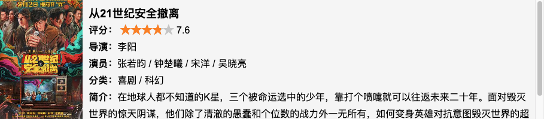

# ContentManager
Typecho内容扩展插件，支持🎬电影、📚书籍、🛍️我的好物的管理。电影、书籍支持从豆瓣导入信息，本地化存储。

[预览地址](https://shawnzeng.com/index.php/archives/3/)

## 使用方式
下载插件解压到插件目录下后，重命名为ContentManager，在typecho后台 控制台->插件 处点击启用即可。
### 书籍
进入 管理->书籍 页面，即可对你的书籍进行管理。在页面右侧，可直接输入该书籍在豆瓣的id，直接获取该书籍的其他信息。当然，作为一个不太相信第三方工具（或者说没啥安全感）的人，我还是支持了让用户手动填写和上传相关内容，以防某天豆瓣的接口挂了，同时，相关数据也做了本地化存储，可以说是安全感十足了~
当需要在文章/页面中插入书籍信息的时候，使用以下短代码即可（目前仅支持以下两种，其他短代码比如list后面空了扩充一下）：
```
[book id=1]
[book id=1,2,3]
```
id为书籍页面显示的id（请注意不是豆瓣id），下面是一个示例：


### 电影
电影功能的使用整体与书籍相似，短代码如下：
```
[movie id=1]
[movie id=1,2,3]
```
同样给一个示例：


### 好物
好物的功能与上面有所区别，没什么可以从第三方获取的数据，纯靠用户自己维护，短代码也有所不同，支持的短代码如下：
```
[good id=1]
[good id=1,2,3]
[good list]
```
以下是一个示例：
<br/>

## 更新日志
- 🍰 2024/06/11 v1.0
  - 插件第一版，支持了🎬电影、📚书籍、🛍️我的好物的管理。